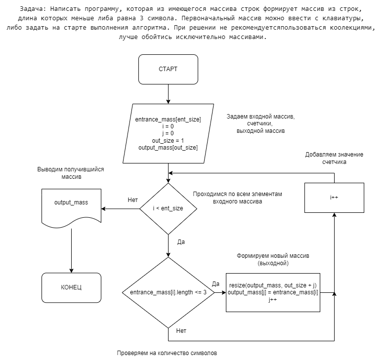

# **Итоговая проверочная работа.**

### _Задача: Написать программу, которая из имеющегося массива строк формирует массив из строк, длина которых меньше либа равна 3 символа. Первоначальный массив можно ввести с клавиатуры, либо задать на старте выполнения алгоритма. При решении не рекомендуется пользоваться коолекциями, лучше обойтись исключительно массивами._ 

## **Решение задачи**

## 1. Нарисуем блок-схему алгоритма.

## 2. Описание решения:

    - Задаем исходный массив со словами различной длины;
    - Задаем функцию поиска слов с длиной меньше либо равной 3 символа;
    - Выводим новый массив со словами длиной меньше либо равно 3 символа.

## 3. Готовая программа решения задачи (написанная на языке C#) находится в файле _Program.cs_.

